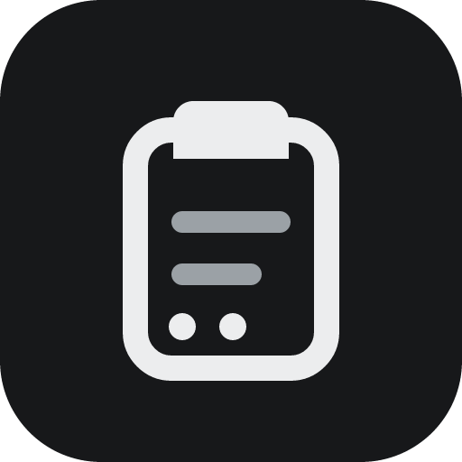

  

  # ClipClop

  **Your clipboard, always one shortcut away.**

  A fast, private clipboard history for macOS and Windows.

  
  
  
  

  [Download](https://github.com/hiQianFan/ClipClop/releases) · [Features](#why-clipclop) · [Privacy](#private-by-design) · [简体中文](README.zh-CN.md)

## Never lose a copy again

ClipClop quietly remembers the text, links, colors, images, and files you copy. Open it from anywhere, find what you need, and paste it back without breaking your flow.

No account. No cloud sync. No feed, workspace, or AI layer. Just the clipboard history you expected your computer to have.

## Why ClipClop

| | |
| --- | --- |
| ⚡ **One shortcut away** | Open ClipClop over any app and search your recent copies instantly. |
| ⌨️ **Made for the keyboard** | Navigate, preview, copy, and paste without reaching for the mouse. |
| 🎨 **More than text** | Keep text with its available formatting, plus links, colors, images, and file references. |
| 🖥️ **At home on both platforms** | A focused desktop experience for macOS and Windows, with light and dark themes. |
| 🔒 **Local by default** | Your clipboard history stays on your device and copied links never trigger background lookups. |
| 🪶 **Quiet and lightweight** | Lives in the tray, stays out of the way, and appears only when you call it. |

## Three keys to your clipboard

1. **Open** — press `⌃⌘C` on macOS or `Ctrl+Alt+C` on Windows.
2. **Find** — start typing or move through your recent copies.
3. **Paste** — press `Enter` to keep available formatting, or `Shift+Enter` for plain text.

The global shortcut is customizable. If direct paste is unavailable, ClipClop leaves the selected content on the system clipboard so you can paste it normally.

## Download

Preview builds will be available from [GitHub Releases](https://github.com/hiQianFan/ClipClop/releases) after the first release is published:

- **macOS:** Universal DMG for Apple Silicon and Intel
- **Windows:** x64 installer

> [!NOTE]
> Preview installers are not yet signed with Apple Developer ID or Windows Authenticode, so your operating system may show a security confirmation. Update files are separately signed to verify their integrity. See the [distribution notes](docs/distribution.md) before installing.

## Private by design

ClipClop has no account, telemetry, advertising, cloud clipboard, or network enrichment. Clipboard contents and settings remain on your current device; only the optional update check contacts GitHub Releases.

Delete individual items, clear the history, choose a retention period, or quit ClipClop to stop capture. For the exact data-handling details, read the [privacy notice (Simplified Chinese)](docs/privacy.md).

## Project status

ClipClop is currently a `0.1.0` preview. macOS and Windows builds are continuously checked, while wider real-device testing is still in progress. Feedback and bug reports are welcome in [GitHub Issues](https://github.com/hiQianFan/ClipClop/issues).

<strong>For contributors</strong>

Development instructions and project conventions live in the [contributing guide](CONTRIBUTING.md). Please report security issues through the [security policy](SECURITY.md), not a public issue.

## License

ClipClop is open source under the [MIT License](LICENSE). If it helps you, a ⭐ makes the project easier for others to discover.
